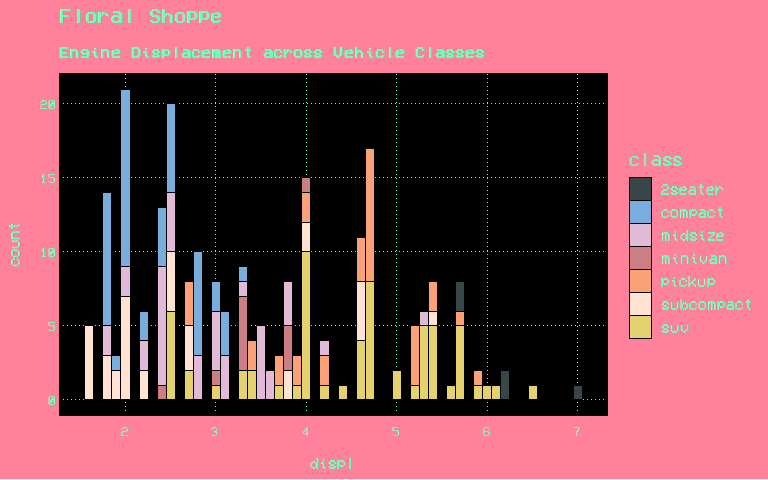
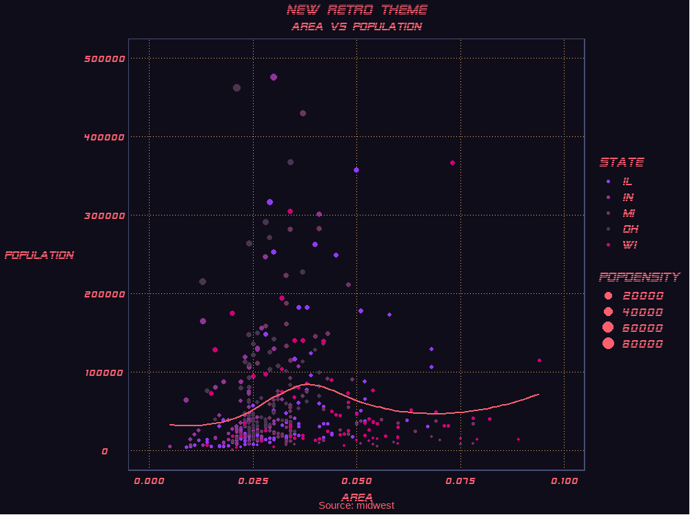
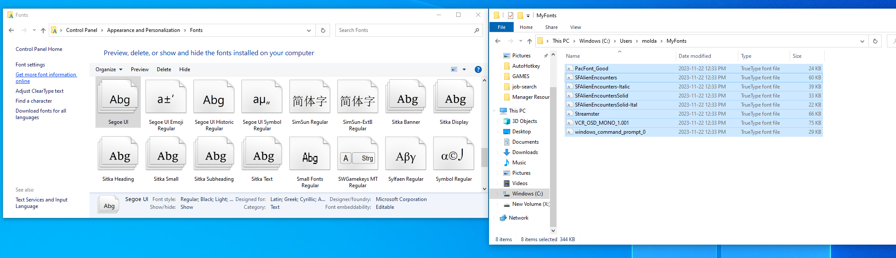
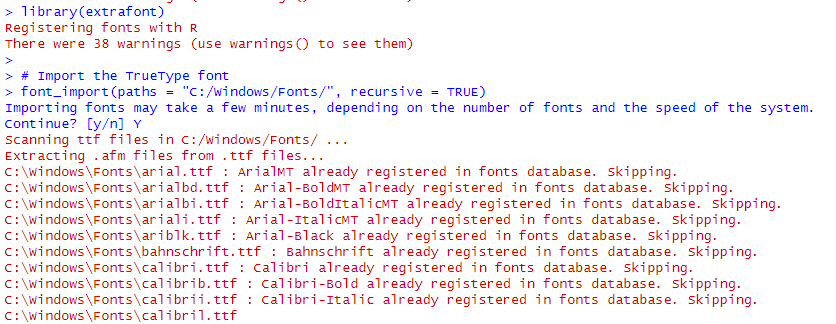

# VapoRwave Themes

[](https://github.com/moldach/vapoRwave/blob/master/LICENSE.md)

**Contact:**
- [Twitter](https://twitter.com/moldach)
- [GitHub](https://github.com/moldach)
- [Personal Website](https://moldach.github.io/)

## Table of Contents
- [Overview](#overview)
- [Installation](#installation)
- [Themes](#themes)
  - [Floral Shoppe](#floral-shoppe)
  - [New Retro Wave](#new-retro-wave)
  - [jwz](#jwz)
- [Vignette](#vignette)
- [Contributing](#contributing)
- [License](#license)

## Overview

`vapoRwave` is an R package that provides `ggplot2` themes inspired by the vaporwave movement, a genre of electronic music and art characterized by nostalgic and satirical takes on consumer capitalism, glitch art, anime, 3D-rendered objects, and cyberpunk tropes.

Explore the aesthetics of vaporwave through themes that mimic iconic album covers and visual styles.

## Installation

Use the `devtools` package to install it.

```r
devtools::install_github("moldach/vapoRwave")

# To include the vignette
devtools::install_github("moldach/vapoRwave", build_vignettes=TRUE)
```

Load packages:


```r
library(vapoRwave)
library(ggplot2)
library(extrafont)
```

## Themes

### Floral Shoppe 


```r
ggplot(mpg, aes(displ)) + 
        geom_histogram(aes(fill=class), 
                   binwidth = .1, 
                   col="black", 
                   size=.1) +  # change binwidth
        labs(title="Floral Shoppe", 
        subtitle="Engine Displacement across Vehicle Classes") + floral_shoppe() + scale_fill_floralShoppe()
```



### New Retro Wave 


```r
options(scipen=999)  # turn-off scientific notation like 1e+48
data("midwest", package = "ggplot2")
ggplot(midwest, aes(x=area, y=poptotal)) + 
  geom_point(aes(col=state, size=popdensity)) + 
  geom_smooth(method="loess", se=F, color = "#FA5F70FF") + 
  xlim(c(0, 0.1)) + 
  ylim(c(0, 500000)) + 
  labs(subtitle="Area Vs Population", 
       y="Population", 
       x="Area", 
       title="New Retro Theme", 
       caption = "Source: midwest") + 
        new_retro() + 
        scale_colour_newRetro() +
        guides(size = guide_legend(override.aes = list(colour = "#FA5F70FF")))
```



### JWZ


```r
ggplot(mpg, aes(class, cty)) +
        geom_boxplot(aes(fill=factor(cyl))) + 
        theme(axis.text.x = element_text(angle=65, vjust=0.6)) + 
        labs(title="Box plot", 
             subtitle="City Mileage grouped by Class of vehicle",
             caption="Source: mpg",
             x="Class of Vehicle",
             y="City Mileage") + 
        jwz() +
        scale_fill_jwz()
```


## Vignettes

For more advanced and complex use-cases, as well as detailed examples and customization options, refer to the [vapoRwave vignette](doc/vapoRwave.html). The vignette explore diverse demos that include information on various palletes, fonts, changing parameters, and integrating with extensions. For a comprehensive guide, consult the vignette for the full potential of the `vapoRwave` package.

When users install tha package and want to access the vignettes, they can use the following command to open them:


```r
library(vapoRwave)
browseVignettes("vapoRwave")
```

## WINDOWS USERS!

For ubuntu users the fonts should be installed effortlessly; however, Windows users need to follow an additional step to use the provided fonts.

The fonts from the `vapoRwave` package will be insalled locally in `C:\Windows\Users\<username>\MyFonts\` and must be moved/copied to **Control Panel -> Appearance and Personalization -> Fonts**




**Each time you launch a new R session you need to run the following commands to make the fonts available**

```r
library(extrafont)
# Import the TrueType fonts
font_import(paths = "C:/Windows/Fonts/", recursive = TRUE)
```

Select `Y` to continue:



Now all the fonts are availabe:

```r
library(vapoRwave)
library(ggplot2)
ggplot(mpg, aes(displ)) + 
        geom_histogram(aes(fill=class), 
                   binwidth = .1, 
                   col="black", 
                   size=.1) +  # change binwidth
        labs(title="Floral Shoppe", 
        subtitle="Engine Displacement across Vehicle Classes") + floral_shoppe() + scale_fill_floralShoppe()
```


## Contributing

Please read [CONTRIBUTING.md](CONTRIBUTING.md) for details on our code
of conduct, and the process for submitting pull requests to us.

## License

This code is released under the MIT License - see the [LICENSE.md](LICENSE.md) file for details.
