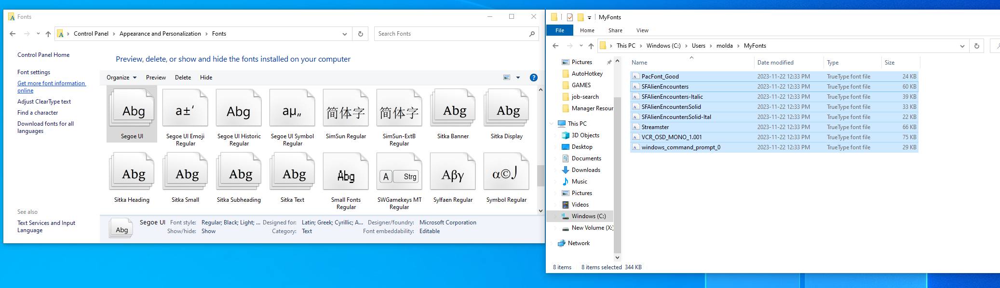
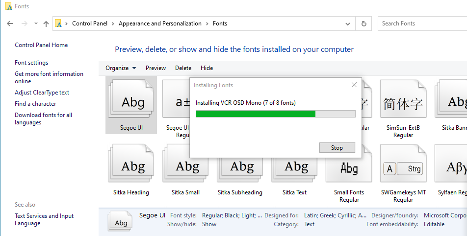
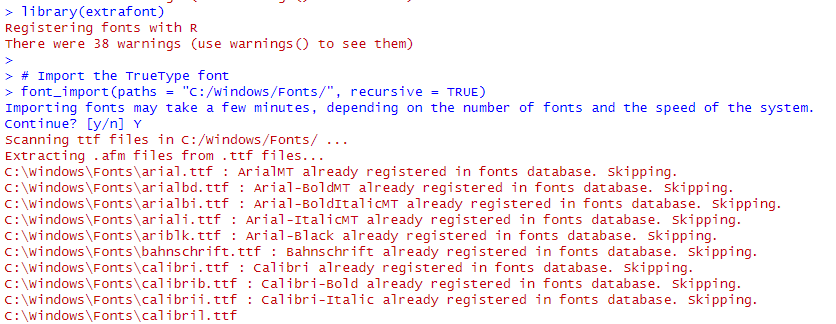
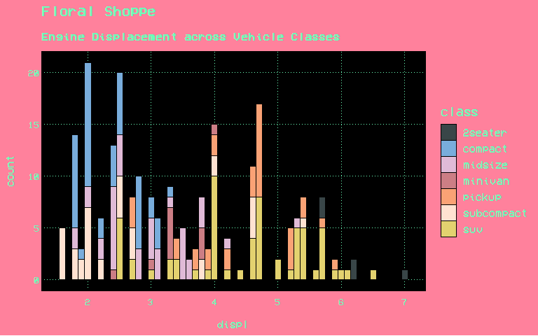
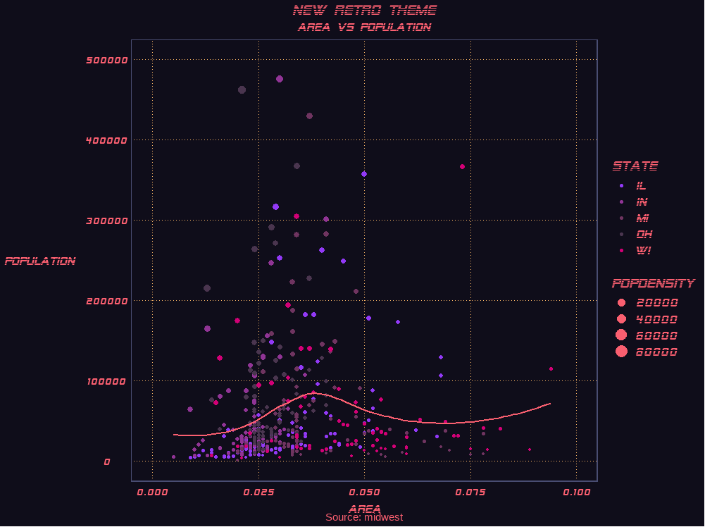
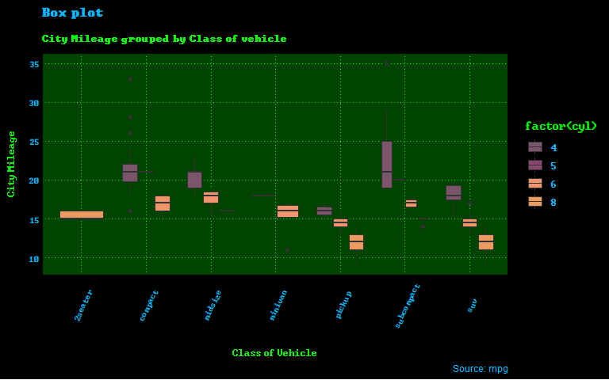
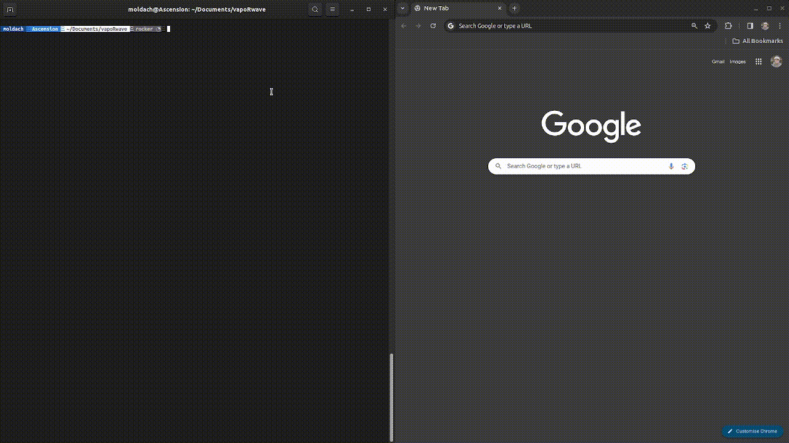
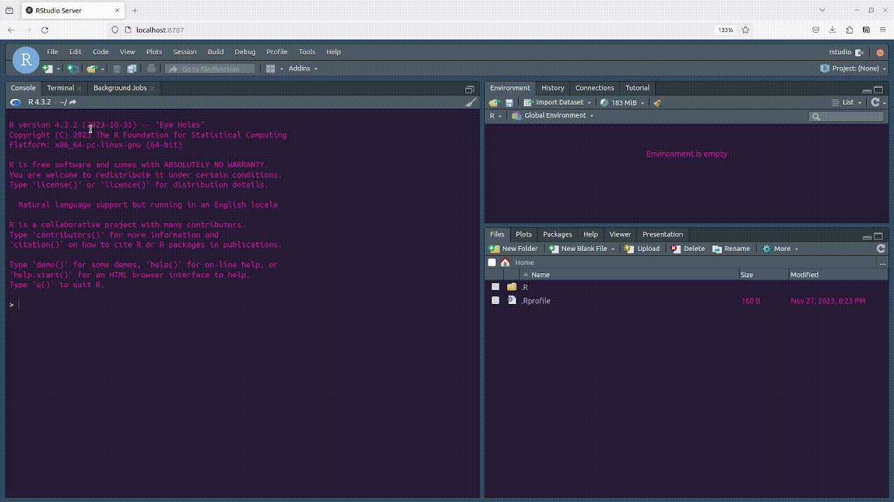

# VapoRwave Themes

[](https://github.com/moldach/vapoRwave/blob/master/LICENSE.md)

**Contact:** - [Twitter](https://twitter.com/moldach) -
[GitHub](https://github.com/moldach) - [Personal
Website](https://moldach.github.io/)

## Table of Contents

  - [Overview](#overview)
  - [Installation](#installation)
      - [Windows Font Installation](#windows-font-installation)
  - [Themes](#themes)
      - [Floral Shoppe](#floral-shoppe)
      - [New Retro Wave](#new-retro-wave)
      - [jwz](#jwz)
  - [Vignettes](#vignettes)
      - [Docker](#docker)
  - [Contributing](#contributing)
  - [License](#license)

## Overview

`vapoRwave` is an R package that provides `ggplot2` themes inspired by
the vaporwave movement, a genre of electronic music and art
characterized by nostalgic and satirical takes on consumer capitalism,
glitch art, anime, 3D-rendered objects, and cyberpunk tropes.

Explore the aesthetics of vaporwave through themes that mimic iconic
album covers and visual styles.

## Installation

Use the `devtools` package to install it.

``` r
devtools::install_github("moldach/vapoRwave")

# To include the vignette
devtools::install_github("moldach/vapoRwave", build_vignettes=TRUE)
```

Load packages:

``` r
library(vapoRwave)
library(ggplot2)
library(extrafont)
```

### Windows Font Installation

While Ubuntu users can effortlessly install fonts, Windows users are
required to take an additional step to utilize the fonts provided.

The fonts from the vapoRwave package will be locally installed in
`C:\Windows\Users\<username>\MyFonts\`. To use them, move/copy the fonts
to **Control Panel -\> Appearance and Personalization -\> Fonts**.




**After each new R session, execute the following commands to make the
fonts available:**

``` r
library(extrafont)
# Import the TrueType fonts
font_import(paths = "C:/Windows/Fonts/", recursive = TRUE)
```

Select `Y` to continue:



## Themes

### Floral Shoppe


``` r
ggplot(mpg, aes(displ)) + 
        geom_histogram(aes(fill=class), 
                   binwidth = .1, 
                   col="black", 
                   size=.1) +  # change binwidth
        labs(title="Floral Shoppe", 
        subtitle="Engine Displacement across Vehicle Classes") + floral_shoppe() + scale_fill_floralShoppe()
```



### New Retro Wave


``` r
options(scipen=999)  # turn-off scientific notation like 1e+48
data("midwest", package = "ggplot2")
ggplot(midwest, aes(x=area, y=poptotal)) + 
  geom_point(aes(col=state, size=popdensity)) + 
  geom_smooth(method="loess", se=F, color = "#FA5F70FF") + 
  xlim(c(0, 0.1)) + 
  ylim(c(0, 500000)) + 
  labs(subtitle="Area Vs Population", 
       y="Population", 
       x="Area", 
       title="New Retro Theme", 
       caption = "Source: midwest") + 
        new_retro() + 
        scale_colour_newRetro() +
        guides(size = guide_legend(override.aes = list(colour = "#FA5F70FF")))
```



### JWZ


``` r
ggplot(mpg, aes(class, cty)) +
        geom_boxplot(aes(fill=factor(cyl))) + 
        theme(axis.text.x = element_text(angle=65, vjust=0.6)) + 
        labs(title="Box plot", 
             subtitle="City Mileage grouped by Class of vehicle",
             caption="Source: mpg",
             x="Class of Vehicle",
             y="City Mileage") + 
        jwz() +
        scale_fill_jwz()
```



## Vignettes

For more advanced and complex use-cases, as well as detailed examples
and customization options, refer to the [vapoRwave
vignette](doc/vapoRwave.html). The vignette explore diverse demos that
include information on various palletes, fonts, changing parameters, and
integrating with extensions. For a comprehensive guide, consult the
vignette for the full potential of the `vapoRwave` package.

When users install the package and want to access the vignettes, they
can use the following command to open them:

``` r
library(vapoRwave)
browseVignettes("vapoRwave")
```

### Docker

Dive into the world of vapoRwave v0.2.0 and experience the perfect blend
of retro aesthetics and modern data visualization within the
[Synthwave85](https://github.com/jnolis/synthwave85) RStudio IDE, now
more accessible than ever\!

The v0.2.0 release streamlines the installation process across various
operating systems. Get the New Retro theme in your IDE coupled with a
pre-configured Python environment via the reticulate package. Python
aficionados can now indulge in retro-flavored coding while leveraging
R’s simple syntax and powerful graphics.

[](https://youtu.be/jtug43o_3Sw)

For your convenience, we offer two ways to get vapoRwave running in a
Docker container:

#### Pull the Pre-Built Docker Image

The easiest way to get started is to pull the pre-built image from
Docker Hub, which was optimized for size and security using
[Slim](https://github.com/slimtoolkit/slim):

``` bash
docker pull moldach686/vaporwave:latest
docker run -p 8787:8787 -e PASSWORD=vaporwave moldach686/vaporwave
```

#### Build from the Dockerfile

Alternatively, if you prefer to build the Docker image yourself from the
Dockerfile:

``` bash
docker build -t vaporwave .
docker run -p 8787:8787 -e PASSWORD=vaporwave vaporwave
```

Either of these options will start vapoRwave and you can access the IDE
by navigating to `http://localhost:8787`` in your web browser. Log in
with the username`rstudio`and the password`vaporwave\`.



For instance, you can leverage Pandas for data wrangling and then
visualize your results with R’s ggplot2, all within this unique
environment.

Once inside the IDE, feel free to install additional R packages through
the *console*. Alternatively, in the *terminal* you can install Python
packages using `pip3` within a Poetry virtual environment, and any
system dependencies using `apt-get`.



Please note that when building from the Dockerfile, you may pull the
latest dependencies, which provides the most up-to-date environment,
while using the pre-built image ensures a consistent, tested setup.

Enjoy the blend of the past and present in data science with vapoRwave
v0.2.0 **Retro Player One**\!🕹️📼🎵

## Contributing

Please read [CONTRIBUTING.md](CONTRIBUTING.md) for details on our code
of conduct, and the process for submitting pull requests to us.

## License

This code is released under the MIT License - see the
[LICENSE.md](LICENSE.md) file for details.
