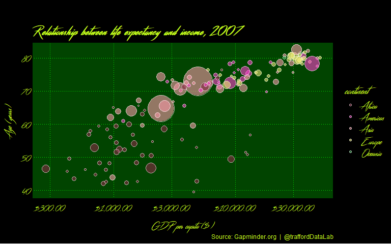
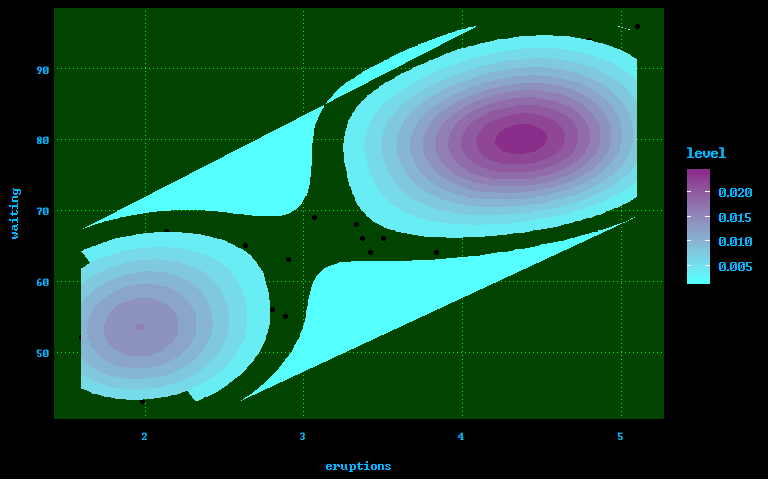

VapoRwave Themes
================
Matthew J. Oldach

Installation
------------

This package isn't on CRAN, so you'll need to use the devtools package to install it.

``` r
# If you don't have devtools installed
install.packages("devtools")
devtools::install_github("moldach/vapoRwave")
```

Introduction
------------

<!-- Links -->


This package provides a number of `ggplot2` themes inspired by [vaporwave](https://en.wikipedia.org/wiki/Vaporwave), both a subgenre of electronic music and an art movement.

On the musical side it's known for it's appropriation of 1980's and 1990's elevator/lounge music along with the application of slowed-down chopped and screwed techniques, looping and other effects.

On the visual side it's know for A E S T H E T I C S with fullwidth characters it's satrical takes on consumer capitalism (*.e.g* the use wih Greco-Roman statues to signify the fall of capitalism), and other nostalgic or surrealist engagement with glitch art, anime, 3D-rendered objects and cyberpunk trope in it's cover art and music videos.

  

Setup theme and scales
----------------------

There are three theme-generating functions:

-   `floral_shoppe()` sets the plot theme to match the most recognized album cover in vaporwave, Vektroid's *Floral Shoppe* released under the one-time pseudonym of [Macintosh Plus](https://en.wikipedia.org/wiki/Floral_Shoppe).
-   `new_retro()` sets the plot theme to match the A E S T H E T I C of [New Retro Wave](https://newretrowave.com/).
-   `jwz()` sets the plot theme to match the personal blog of the American programmer [jwz](https://www.jwz.org/blog/).

Color Palette's
---------------

The colors for this theme were drawn from many vaporwave images; I selected those that worked well together for color and fill scales.

### Floral Shoppe Palette


### New Retro Palette


### jwz Palette


### Hotline Bling Palette


### Hyper Bubble Palette


Demos
-----

``` r
library(tidyverse)
library(vapoRwave)
library(extrafont)
#> Registering fonts with R
```

### Floral Shoppe


``` r
# use palette_03
ggplot(mpg, aes(displ)) + 
        geom_histogram(aes(fill=class), 
                   binwidth = .1, 
                   col="black", 
                   size=.1) +  # change binwidth
        labs(title="Floral Shoppe", 
        subtitle="Engine Displacement across Vehicle Classes") + floral_shoppe() + scale_fill_floralShoppe()
```


### New retro


``` r
options(scipen=999)  # turn-off scientific notation like 1e+48
data("midwest", package = "ggplot2")
ggplot(midwest, aes(x=area, y=poptotal)) + 
  geom_point(aes(col=state, size=popdensity)) + 
  geom_smooth(method="loess", se=F, color = "#FA5F70FF") + 
  xlim(c(0, 0.1)) + 
  ylim(c(0, 500000)) + 
  labs(subtitle="Area Vs Population", 
       y="Population", 
       x="Area", 
       title="New Retro Theme", 
       caption = "Source: midwest") + new_retro()
#> Warning: Removed 15 rows containing non-finite values (stat_smooth).
#> Warning: Removed 15 rows containing missing values (geom_point).
```


### JWZ Style


``` r
library(ggthemes)
ggplot(mpg, aes(class, cty)) +
        geom_boxplot(aes(fill=factor(cyl))) + 
        theme(axis.text.x = element_text(angle=65, vjust=0.6)) + 
        labs(title="Box plot", 
             subtitle="City Mileage grouped by Class of vehicle",
             caption="Source: mpg",
             x="Class of Vehicle",
             y="City Mileage") + jwz()
```


Fonts
-----

You will need to download the following `ttf` fonts to use this package. You can import them with the [`extrafont` package](https://github.com/wch/extrafont).

-   [Alien Encounters](http://www.hipsthetic.com/alien-encounters-free-80s-font-family/) the font used by the Dream Catalogue Vaporwave record label. This typeface invokes the forward learning, horizontally sliced fonts of Blade Runner and Tron.
-   [VCR OSD Mono](http://www.hipsthetic.com/vcr-osd-mono-free-pixel-font/) a font that evokes a child-like nostalgia associated with 8-bit consoles and malfunctioning VHS tapes.
-   [Windows Command Prompt](https://www.dafont.com/windows-command-prompt.font)
-   [Blade Runner](https://www.fontspace.com/phil-steinschneider/blade-runner-movie-font) a font from the motion picture Blade Runner.
-   [Streamster](http://www.hipsthetic.com/streamster-free-80s-script-font/) a font that can be used with vintage textures, 80's iconography and neon-lit colour palettes.

To verify the installation of these font's on your OS you can look for them with:

``` r
extrafont::fonts()
```

The above installations wil give you the following fonts

-   `SF Alien Encounters`
-   `SF Alien Encounters Solid`
-   `VCR OSD Mono`
-   `OCR A Extended`
-   `Windows Command Prompt`
-   `Blade Runner Movie Font`
-   `Streamster`

That being said you can use any `ttf` font with the `vapoRwave` package.

``` r
var <- mpg$class  # the categorical data 

## Prep data (nothing to change here)
nrows <- 10
df <- expand.grid(y = 1:nrows, x = 1:nrows)
categ_table <- round(table(var) * ((nrows*nrows)/(length(var))))
categ_table
#> var
#>    2seater    compact    midsize    minivan     pickup subcompact 
#>          2         20         18          5         14         15 
#>        suv 
#>         26
#>   2seater    compact    midsize    minivan     pickup subcompact        suv 
#>         2         20         18          5         14         15         26 

df$category <- factor(rep(names(categ_table), categ_table))  
# NOTE: if sum(categ_table) is not 100 (i.e. nrows^2), it will need adjustment to make the sum to 100.

## Plot
ggplot(df, aes(x = x, y = y, fill = category)) + 
    geom_tile(color = "black", size = 0.5) +
    scale_x_continuous(expand = c(0, 0)) +
    scale_y_continuous(expand = c(0, 0), trans = 'reverse') +
    scale_fill_newRetro() +
    labs(title="Waffle Chart", subtitle="'Class' of vehicles",
         caption="Source: mpg") + new_retro(font = "SF Alien Encounters Solid", text.color = "pink")
```


``` r
library(gapminder)
ggplot(filter(gapminder, year == 2007), aes(x = gdpPercap, y = lifeExp)) +
    scale_x_log10(labels = scales::dollar) +
    geom_point(aes(size = pop, fill = continent), shape = 21, colour = "white", alpha = 0.6) +
    scale_size_continuous(range = c(1, 20)) +
    labs(title = "",
         subtitle = "Relationship between life expectancy and income, 2007",
         caption = "Source: Gapminder.org  |  @traffordDataLab",
         x = "GDP per capita ($)",
         y = "Age (years)") +
    guides(size = FALSE) +
    jwz(font = "Streamster", text.color = "#c3fe1b", subtitle.size = 16) + scale_fill_hyperBubble()
```



Changing parameters
-------------------

You are able to change most `ggplot2::theme()` elements from `new_retro()`, `floral_shoppe()` and `jwz()` themes.

``` r
df <- gapminder %>% 
  filter(country %in% c("France", "Germany", "Ireland", "Italy")) %>% 
  mutate(year = as.Date(paste(year, "-01-01", sep = "", format='%Y-%b-%d')))

ggplot(df, aes(x = year, y = gdpPercap, fill = country)) +
  geom_area(alpha = 0.4) +
  scale_x_date(breaks = df$year, date_labels = "%Y") +
  scale_y_continuous(expand = c(0, 0), labels = scales::dollar) +
  labs(title = "",
       subtitle = "GDP per capita by country, 1952-2007",
       caption = "Source: Gapminder.org  |  @traffordDataLab",
       x = NULL,
       y = "GDP per capita ($)",
       fill = NULL) +
  floral_shoppe(text.color = "black", font = "OCR A Extended", legend.position = "bottom") +
  scale_fill_newRetro()
```


``` r
library(forecast)

# Subset data
nottem_small <- window(nottem, start=c(1920, 1), end=c(1925, 12))  # subset a smaller timewindow

# Plot (capital "B" is the Blade Runner guy)
ggseasonplot(nottem_small) + labs(title="Seasonal B plot:", subtitle = "Air temperatures at Nottingham Castle") + scale_colour_jwz() + new_retro(font = "Blade Runner Movie Font")
```


`vapoRwave` also works with `ggplot2` extensions.

``` r
library(ggcorrplot)
mydata <- mtcars[, c(1,3,4,5,6,7)]
corr <- round(cor(mydata),1)
ggcorrplot(corr, hc.order = T, 
           type = 'lower',
           outline.color = 'white',
           ggtheme = ggplot2::theme_bw,
           colors = c('#79ADDC', 'white', '#CC7E85'),
           lab = T) + floral_shoppe()
```


If you need to use a color gradient take a look at the html color codes for the palette in the `Readme_files` folder and insert your choice in `low` and `high`.

``` r
ggplot(faithful, aes(x = eruptions, y = waiting)) +
        geom_point() + stat_density_2d(aes(fill = ..level..), geom = "polygon") +
        jwz() + 
        scale_fill_gradient(low = "#55FFFF", high = "#8B2E8B")
```


